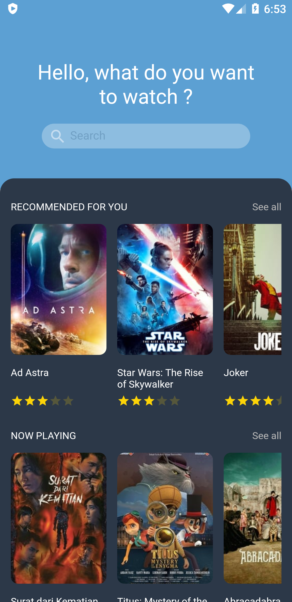
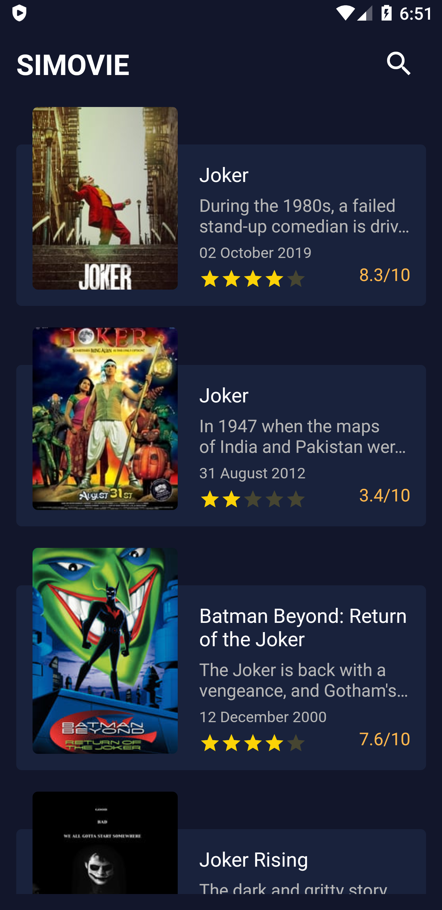

# simple movie app 
Discover Movies

<table>
  <thead>
    <th>Home</th>
    <th>Detail</th>
    <th>Search list</th>
  </thead>
  <tbody>
    <td></td>
    <td></td>
    <td></td>
  </tbody>
</table>

### Requirements
- [Node](https://nodejs.org/) >= 10.15.3
- [npm](https://npmjs.com) >= 6.4.1

### Installation

Clone this repo

```sh
$ git clone https://github.com/varid68/simovie.git
$ cd simovie
$ yarn install or npm install
```

Create `.env` file in your root directory and add the following

```sh
TMDB_API_KEY=your_tmdb_api_key_here

```

Get api key - [TMDB](https://www.themoviedb.org/)

Thanks to Mickael Guillaume for his awesome design [link uplabs](https://www.uplabs.com/posts/movies-e0f9c1ea-a644-4666-857b-10933c4089ca) and TMDb for Open API Movie
